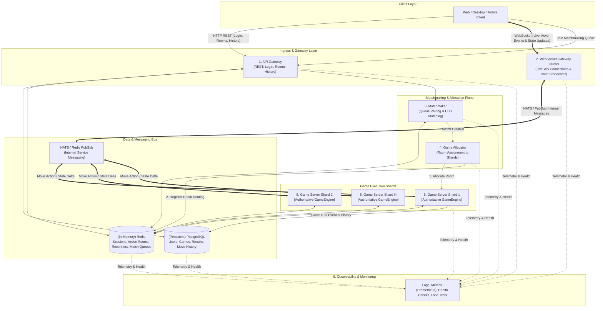

# High-Scale Server Architecture: Kung-Fu Chess

## 1. Executive Summary & Core Architectural Principles

Designing a robust backend for **Kung-Fu Chess** requires handling real-time, non-turn-based chess gameplay where pieces have individual movement cooldowns and move continuously. To guarantee fairness, low latency, high availability, and seamless scalability, the system relies on a modular microservices architecture.

### Single Source of Truth Directive
> [!IMPORTANT]
> Neither the **client** nor the **Gateway** decides or validates game rules. 
> The **`GameEngine`** running inside the **Game Server Shards** is the **single source of truth** for all game state calculations, move validations, board positions, and cooldown timings.

---

## 2. Core Architecture Overview & System Components

The system is decoupled into **6 main components**, each with specific responsibilities:

1. **API Gateway**  
   Handles all non-real-time REST HTTP operations: player login/authentication, user profiles, room creation and metadata browsing, leaderboards, and historical game lookups.
2. **WebSocket Gateway**  
   Manages persistent live WebSocket connections with clients, receives client input actions, and broadcasts real-time state updates back to players and spectators.
3. **Matchmaker**  
   Pairs waiting players based on skill ratings (ELO), game mode preferences, and queue time parameters.
4. **Game Allocator**  
   Monitors Game Server Shard cluster load and decides which specific Game Server Shard will host each newly created room/match.
5. **Game Server Shards (Authoritative GameEngine)**  
   Runs the live games themselves. Each shard hosts in-memory authoritative `GameEngine` instances that enforce chess rules, validate moves, track piece cooldowns, detect game-ending conditions, and produce state deltas.
6. **Observability**  
   Provides system-wide operational visibility through centralized logging, metrics collection, automated health checks (liveness/readiness probes), and synthetic load testing tools.

---

## 3. Architecture Diagram



---

## 4. Recommended Technology Stack

```
┌─────────────────────────────────────────────────────────────────────────────┐
│                           TECHNOLOGY STACK SUMMARY                          │
├───────────────────────┬─────────────────────────────┬───────────────────────┤
│ Layer / Role          │ Technology                  │ Purpose               │
├───────────────────────┼─────────────────────────────┼───────────────────────┤
│ Internal Communication│ NATS / Redis PubSub         │ Fast inter-service    │
│                       │                             │ event streaming & bus │
├───────────────────────┼─────────────────────────────┼───────────────────────┤
│ Temporary / Fast Data │ Redis                       │ Sessions, active rooms│
│                       │                             │ reconnect, match queue│
├───────────────────────┼─────────────────────────────┼───────────────────────┤
│ Permanent Data        │ PostgreSQL                  │ Users, game outcomes, │
│                       │                             │ results, move history │
├───────────────────────┼─────────────────────────────┼───────────────────────┤
│ Local Environment     │ Docker Compose              │ Small dev setup of all│
│                       │                             │ microservices         │
├───────────────────────┼─────────────────────────────┼───────────────────────┤
│ Production Scaling    │ Kubernetes / K3s            │ Managed container     │
│                       │                             │ orchestration & HPA   │
└───────────────────────┴─────────────────────────────┴───────────────────────┘
```

### 1. Internal Communication: NATS / Redis PubSub
- **Role**: Serves as the high-throughput, low-latency backbone for internal message passing between WebSocket Gateways and Game Server Shards.
- **Function**: When a client sends a move packet to a WebSocket Gateway, the Gateway publishes a `MoveCommand` event over NATS/PubSub to the specific Game Server Shard hosting that room. Conversely, when the `GameEngine` updates board state, state broadcast events are published back to the appropriate WebSocket Gateways for client fanout.

### 2. Temporary Data Store: Redis
- **Role**: In-memory database for ephemeral state requiring sub-millisecond access times.
- **Stored Information**:
  - **User Sessions & Tokens**: Active authentication state and user presence.
  - **Active Rooms Routing Table**: Maps `room_id -> {shard_id, shard_ip, ws_gateway_id}`.
  - **Reconnect Tokens**: Session recovery state allowing disconnected players to seamlessly reconnect to active matches.
  - **Matchmaking Queue**: Redis Sorted Sets (`ZADD`) organized by ELO ratings for rapid player matching.

### 3. Permanent Data Store: PostgreSQL
- **Role**: Relational database providing ACID guarantees for long-term data durability.
- **Stored Information**:
  - **Users**: Account credentials, profiles, persistent ELO scores, statistics.
  - **Games & Results**: Match outcomes, winner/loser IDs, rating adjustments.
  - **Move History**: Complete move-by-move game logs (PGN/JSON format) for game playback and anti-cheat auditing.

### 4. Local Environment: Docker Compose
- **Role**: Defines and runs all microservices (API Gateway, WS Gateway, Matchmaker, Allocator, Game Shards, Redis, PostgreSQL, NATS) together in a lightweight local container environment.
- **Purpose**: Enables developers to test the full system stack on a single machine without cloud dependencies.

### 5. Production Infrastructure: Kubernetes / K3s
- **Role**: Container orchestration system for production and staging environments.
- **Capabilities**:
  - **Horizontal Scaling**: Automatically scales WebSocket Gateway pods based on active connection load, and Game Server Shards based on room concurrency.
  - **Self-Healing & Health Checks**: Automatically restarts failing pods using liveness and readiness probes.
  - **Zero-Downtime Draining**: Gracefully drains Game Server Shards before shutting down nodes during scale-down operations.

---

## 5. Microservice Deep Dives & Workflow

### 1. API Gateway (Non-Real-Time REST)
- Handles HTTP requests for authentication (`/auth/login`, `/auth/register`), user profiles (`/user/profile`), historical game records (`/games/history`), and custom room creation metadata.
- Validates JWT tokens and communicates with PostgreSQL for persistent lookups and Redis for session cache.

### 2. WebSocket Gateway (Live Ingress & Egress)
- Maintains persistent WSS (WebSocket Secure) connections with thousands of concurrent client apps.
- Performs connection heartbeats (ping/pong), TLS termination, packet deserialization, and client rate limiting.
- **Does not contain game logic**: Acts purely as a network routing layer, relaying player actions to the assigned Game Server Shard via NATS/PubSub and delivering broadcast state updates back to clients.

### 3. Matchmaker (Player Pairing)
- Runs asynchronously to match queued players.
- Fetches waiting tickets from the Redis matchmaking queue based on ELO tolerance brackets.
- Upon forming a valid match between two players, it generates a `room_id` and forwards the match creation request to the **Game Allocator**.

### 4. Game Allocator (Shard Selection & Routing)
- Maintains active health status and current room capacities of all registered **Game Server Shards**.
- Selects the optimal shard to host the new match based on current memory and CPU metrics.
- Registers the assignment mapping (`room_id -> shard_id`) in Redis so WebSocket Gateways know where to route move packets for that room.

### 5. Game Server Shards & Authoritative GameEngine
- **Authoritative Execution**: Each shard hosts multiple concurrent room instances running the core `GameEngine`.
- **Validation**: When a move command arrives via NATS/PubSub:
  1. The `GameEngine` verifies that the player owns the piece.
  2. Verifies that the piece has completed its cooldown period.
  3. Verifies that the target square is a legal move according to chess rules.
- **State Update**: If valid, the move is applied, piece cooldown timers reset, and an updated `StateDelta` packet is published back via NATS/PubSub.
- **Game Completion**: On checkmate, draw, or resignation, the `GameEngine` marks the match as finished, notifies players, and streams final match results and move history into PostgreSQL.

### 6. Observability & System Monitoring
- **Metrics**: Prometheus scrapers collect metrics from all services (e.g., active WebSocket sockets, move latency, matchmaker queue depth, shard CPU/memory usage) for visualization on Grafana dashboards.
- **Logs**: Centralized logging via Loki or ELK stack for rapid troubleshooting.
- **Health Checks**: Standardized `/healthz` endpoints checked by Kubernetes Liveness/Readiness probes.
- **Load Testing**: Automated k6/Locust scripts to simulate thousands of simultaneous bots placing moves to test throughput and stability under peak stress.

---

## 6. Game Lifecycle & Message Flow Example

```
Player A                        WebSocket Gateway                 Matchmaker / Allocator               Game Server Shard
   │                                   │                                    │                                  │
   ├─ 1. HTTP Login ──────────────────>│ (API Gateway) ────────────────────>│ ──> Saves session in Redis        │
   │                                   │                                    │                                  │
   ├─ 2. Connect WebSocket ───────────>│ Holds persistent WS connection     │                                  │
   │                                   │                                    │                                  │
   ├─ 3. Request Matchmaking ─────────>│ ── Publishes ticket to Redis ─────>│ Matchmaker pairs Player A & B    │
   │                                   │                                    │ Allocator picks Shard #3         │
   │                                   │                                    │ Registers room_101 in Redis ────>│ Starts GameEngine
   │                                   │<── Match Assigned Event ───────────┴──────────────────────────────────┤
   │<── Match Started WS Notification ─┤                                                                       │
   │                                   │                                                                       │
   ├─ 4. Client Sends Move (e2 -> e4) ─>│                                                                       │
   │                                   │── 5. Publish Move Command via NATS/PubSub ───────────────────────────>│ 6. GameEngine Validates Move
   │                                   │                                                                       │    Updates Board & Cooldowns
   │                                   │<── 7. Publish State Delta Event via NATS/PubSub ──────────────────────┤
   │<── 8. WS Broadcasts New State ────┤                                                                       │
```

---

## 7. Summary & Architectural Compliance

| Requirement | Implementation Detail |
| :--- | :--- |
| **API Gateway** | Manages non-real-time REST routes (login, rooms, history). |
| **WebSocket Gateway** | Manages live WS connections and broadcasts state updates. |
| **Matchmaker** | Pairs players based on ELO queues in Redis. |
| **Game Allocator** | Selects target Game Server Shard for each room. |
| **Game Server Shards** | Hosts in-memory authoritative `GameEngine` loops. |
| **Observability** | Centralized logs, metrics, health checks, and load testing. |
| **NATS / Redis PubSub** | Internal inter-service messaging bus. |
| **Redis** | Volatile data: Sessions, active rooms, reconnects, matchmaking queue. |
| **PostgreSQL** | Durable data: Users, completed games, results, move history. |
| **Docker Compose** | Local dev deployment for running full small-scale system. |
| **Kubernetes / K3s** | Production container orchestration and auto-scaling. |
| **Single Source of Truth** | **GameEngine** inside Game Server Shards exclusively determines game rules and valid moves. |
