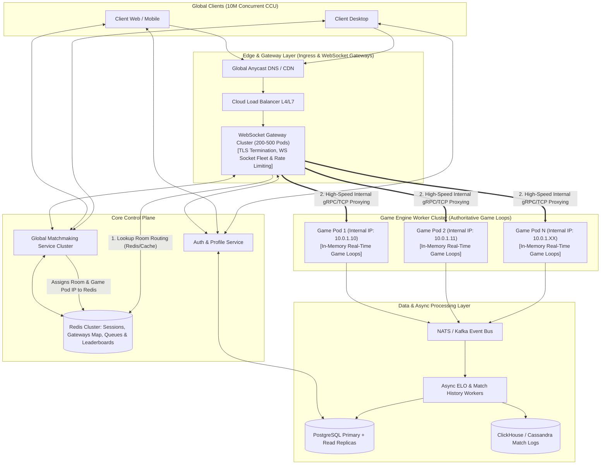

# High-Scale Cloud Server Architecture: Kung-Fu Chess

## 1. Executive Summary & Overview

Designing a cloud backend for **Kung-Fu Chess** capable of supporting **100 million registered users** and **10 million simultaneous active players (CCU)** requires a high-performance, distributed, horizontally scalable microservices system. Unlike traditional turn-based chess, Kung-Fu Chess is a real-time game where moves, cooldowns, and board state updates happen continuously.

Based on our architectural review, we utilize a **WebSocket Gateway Architecture (API & WebSocket Gateway Layer)** paired with a **Polyglot Persistence Layer**. Global clients establish persistent WebSocket connections to a distributed **WebSocket Gateway Cluster**. The Gateway cluster handles TLS termination, authentication, connection maintenance, and packet routing. Internal move commands are proxied over high-speed internal RPC/TCP to authoritative **Game Engine Worker Pods**, while **Redis** manages global session routing, player reconnection maps, matchmaking queues, and real-time state lookup.

---

## 2. High-Level Architecture Diagram



---

## 3. Requirement 1: Database Architecture (100 Million Registered Users)

### Is SQLite suitable?
**No. SQLite is completely unsuitable for this scale.**

#### Reasons why SQLite fails:
1. **Write Concurrency Bottleneck**: SQLite uses file/database-level write locks (even in WAL mode, only one write transaction occurs at a time). With 10M active players generating rating updates, registrations, and game results, write lock contention would stall the system immediately.
2. **Single-File Limits**: SQLite is a local file-based database. It cannot be natively sharded or horizontally distributed across cloud nodes or Kubernetes pods.
3. **No Native High Availability**: Lacks multi-master clustering, failover mechanisms, connection pooling, and multi-region replication.

---

### Recommended Polyglot Database Strategy

To handle 100 million accounts efficiently, a **Polyglot Persistence** model is used:

```
┌─────────────────────────────────────────────────────────────────────────────┐
│                             POLYGLOT DATA STORAGE                           │
├───────────────────────┬─────────────────────────────┬───────────────────────┤
│ PostgreSQL (Relational)│ Redis Cluster (In-Memory)  │ Cassandra / ClickHouse│
├───────────────────────┼─────────────────────────────┼───────────────────────┤
│ • User Credentials    │ • Gateway Session Directory │ • Completed Game Logs │
│ • Account Profiles    │ • Room Routing Table        │ • Move Telemetry      │
│ • Persistent ELO      │ • Active Player Presence    │ • Anti-cheat Logs     │
│ • Account Metadata    │ • Matchmaking Queues        │ • Historical Analytics│
│                       │ • Real-time Leaderboards    │                       │
└───────────────────────┴─────────────────────────────┴───────────────────────┘
```

1. **User Accounts & ELO Ratings (PostgreSQL + Read Replicas)**:
   - **Data Volume**: 100M user records @ ~1 KB/user = **~100 GB total storage**. This easily fits within a managed PostgreSQL cluster (e.g., AWS RDS / GCP Cloud SQL with PgBouncer connection pooling).
   - **Scaling**: Primary node for writes; multiple Read Replicas for user login and profile fetches.

2. **Reconnection, Gateway Routing & Matchmaking (Redis Cluster)**:
   - Ultra-fast memory store used for session tracking (`user_id -> gateway_pod_id`), room routing (`room_id -> game_engine_pod_ip`), matchmaking queue management, and instantaneous player reconnection mapping.

3. **Game History & Telemetry (Cassandra / ClickHouse)**:
   - Append-only NoSQL columnar store designed for high-throughput distributed writes for recording millions of finished matches per hour.

---

## 4. Requirement 2: 10 Million Concurrent Users (CCU) & Server Distribution

### Is one server enough?
**No.** 10 million concurrent WebSocket connections require over 100 GB of RAM just for OS TCP socket buffers and kernel handles, far exceeding physical host limits for network cards (NICs), CPU cores, and memory.

---

### WebSocket Gateway Architecture & Player Routing

We implement a dedicated **WebSocket Gateway Layer**:

```
1. Client connects ──> 2. Persistent WS connection maintained on Gateway Pod #12
                                                │
[Player 1] ═══ Public WS ═══════════════════════┼═══ Public WS ═══ [Player 2]
                                                │
                                    [Gateway Pod #12]
                                                │
                       3. Internal gRPC / High-Speed TCP (VPC)
                                                │
                                                ▼
                                    [Game Engine Pod #42]
                              (Authoritative Real-Time Loop)
```

1. **Persistent WebSocket Fleet**:
   - Clients maintain a long-running WebSocket connection to a **WebSocket Gateway Pod** (e.g., `Gateway Pod #12`).
   - The Gateway fleet handles TLS termination, heartbeats, authentication, rate limiting, and frame parsing.

2. **Matchmaking & Internal Room Routing**:
   - When the Global Matchmaker pairs two players, it assigns the match (`room_id`) to an available internal **Game Engine Pod** (e.g., `Game Engine Pod #42` at IP `10.0.1.10`) and registers the routing in Redis: `room_99 -> 10.0.1.10`.
   - Players do **not** re-establish network sockets. Instead, their existing Gateway Pods route move packets internally to `Game Engine Pod #42` via high-speed internal TCP/gRPC.

3. **Key Architectural Advantages of the Gateway Pattern**:
   - **Socket Decoupling**: Game Engine Pods do not hold public TCP sockets or manage client disconnects, keeping them CPU-efficient for real-time game state computation.
   - **Seamless Multi-Match Persistence**: Players remain connected to their Gateway node between matches. Starting a new match requires zero WebSocket reconnection overhead.
   - **DDoS Insulation**: Internal Game Engine Pods have no public IP addresses and are protected behind the Gateway cluster.

---

### What Redis Is (and Is NOT) Used For in This Architecture

| Function | Uses Redis? | Description |
| :--- | :---: | :--- |
| **Active Live Game Moves** | ❌ **No** | Sent via WebSocket to Gateway, then proxied via internal TCP/gRPC directly to Game Engine Pod. |
| **Gateway & Connection Directory** | ✅ **Yes** | Stores `user_id -> {gateway_pod_id, session_token}` for active WS connections. |
| **Room Routing Directory** | ✅ **Yes** | Maps `room_id -> {game_engine_pod_ip, game_pod_id}` for instant Gateway packet proxying. |
| **Reconnection & Crash Recovery** | ✅ **Yes** | Stores match state references so reconnected clients immediately bind back to their game. |
| **Matchmaking Queue** | ✅ **Yes** | Redis Sorted Sets (`ZADD`) partitioned by ELO rating brackets. |
| **Presence & Anti-Double Login** | ✅ **Yes** | Tracks active sessions across the Gateway fleet to prevent duplicate logins. |
| **Spectating Lookup** | ✅ **Yes** | Maps a player's ID to their active room and Gateway/Game Engine Pod for live spectating. |
| **Real-time Leaderboard** | ✅ **Yes** | Global ELO rankings queried in sub-milliseconds. |

---

### Role Separation Across Docker Containers / Pods

| Server / Pod Role | Primary Responsibility | Scaling Metric | Statefulness |
| :--- | :--- | :--- | :--- |
| **API & Auth Pods** | User login, JWT generation, profile management | HTTP Requests / CPU | **Stateless** |
| **WebSocket Gateway Pods** | Client WS connection fleet (10M CCU), TLS termination, packet forwarding | Concurrent TCP Sockets / Network Bandwidth | **Stateful** (Client TCP Sockets) |
| **Matchmaker Pods** | ELO-based player pairing, ticketing, room allocation | Queue Depth / CPU | **Stateless** |
| **Game Engine Pods** | Authoritative real-time game loops, state validation, move cooldowns | Active Rooms / CPU | **Stateful** (In-Memory Room State) |
| **Async Worker Pods** | Consuming game end events, updating PostgreSQL & ClickHouse | Event Queue Lag | **Stateless** |

---

## 5. Requirement 3: Network Traffic & Bandwidth Analysis

### Traffic Calculations

- **Active Players**: $10,000,000$ (5,000,000 simultaneous 1v1 matches).
- **Move Rate**: Average 1 move every 2 seconds per player ($0.5 \text{ moves/sec/player}$).
- **Total System Move Frequency**:
  $$\text{Moves/sec} = 10,000,000 \times 0.5 = 5,000,000 \text{ moves per second}$$

#### Payload Sizes (Optimized Binary / Protocol Buffers):
- **Client Move Request Packet**: $\sim 150 \text{ bytes}$ (Player ID, Game ID, Piece ID, Target Coordinates, Timestamp).
- **Server Broadcast State Delta**: $\sim 150 \text{ bytes}$ sent to **both** players per move ($\approx 300 \text{ bytes total outbound}$).

#### Bandwidth Estimation (External & Internal VPC):
1. **Client-to-Gateway Inbound Traffic**:
   $$5,000,000 \text{ moves/sec} \times 150 \text{ bytes} = 750,000,000 \text{ B/s} = 750 \text{ MB/s} \approx \mathbf{6.0 \text{ Gbps}}$$
2. **Gateway-to-Game Engine Internal Inbound Traffic**:
   $$5,000,000 \text{ moves/sec} \times 150 \text{ bytes} = \mathbf{6.0 \text{ Gbps}}$$
3. **Game Engine-to-Gateway Internal Outbound Traffic**:
   $$5,000,000 \text{ moves/sec} \times 300 \text{ bytes} = \mathbf{12.0 \text{ Gbps}}$$
4. **Gateway-to-Client External Outbound Traffic**:
   $$5,000,000 \text{ moves/sec} \times 300 \text{ bytes} = 1,500,000,000 \text{ B/s} = 1.5 \text{ GB/s} \approx \mathbf{12.0 \text{ Gbps}}$$
5. **System Overhead & Heartbeats**:
   - Add $\sim 25\%$ overhead for WebSocket framing, TCP ACKs, and keepalive pings.
   - **Total Aggregate System Throughput** (Internal VPC + External Edge): $\mathbf{\sim 45.0 \text{ Gbps}}$.

---

### Is this a lot or a little for an Internet network?

- **For a Single Machine**: **Impossible.** Standard single-server NIC limits are typically 1 Gbps or 10 Gbps.
- **For Cloud Infrastructure (AWS / GCP / Azure)**: **Completely manageable.**
  - **Gateway Layer**: Distributed across **200–500 WebSocket Gateway Pods**, each container handling $\sim 20,000–50,000$ connections and $\sim 50–100 \text{ Mbps}$ egress/ingress.
  - **Internal Network**: Modern cloud VPC backbones easily handle multi-gigabit internal East-West traffic (up to 100 Gbps network fabrics).

---

## 6. Requirement 4: Game Duration (30–90 Seconds) & Docker Role Lifecycle

### Impact of Short Game Lifespans on System Architecture

With an average match duration of 60 seconds and 5,000,000 concurrent games:
$$\text{Match Churn Rate} = \frac{5,000,000 \text{ games}}{60 \text{ seconds}} \approx \mathbf{83,333 \text{ games starting and finishing per second!}}$$

---

### Critical Architectural Decisions for Docker Containers

1. **NEVER Spawn a Container per Game**:
   - Spawning and destroying 83,333 Docker containers per second would overwhelm cgroups and the container daemon.
   - **Solution**: Docker containers operate as **Long-Running Persistent Worker Nodes**. Each Game Engine Pod hosts thousands of lightweight, concurrent game loops running inside async task runners (e.g., Python `asyncio`, Go `goroutines`, or Erlang actors).

2. **WebSocket Connection Reuse Across Games**:
   - Because clients connect to the **WebSocket Gateway Layer**, short match lifespans (30–90s) do not force clients to teardown and re-establish TLS/WebSocket connections. When a game ends, the player stays on the same Gateway connection and enters matchmaking again immediately.

3. **Asynchronous Non-Blocking Game Completion**:
   - When a match finishes, the Game Engine Pod emits a `MatchFinishedEvent` to an in-memory event bus (**NATS / Kafka**) and immediately frees the room memory ($<1 \text{ ms}$).
   - Independent **Async Worker Containers** consume these events from the queue, batching updates into PostgreSQL and ClickHouse asynchronously.

4. **Elastic Pod Autoscaling & Zero-Downtime Draining (K3s / K8s)**:
   - Short match durations (30–90s) make autoscaling extremely responsive.
   - When scaling down game engine nodes during off-peak hours, a pod is marked as `Draining`. It stops accepting new matches from the Matchmaker, waits at most **90 seconds** for active matches on that pod to finish naturally, and then shuts down cleanly without terminating any live player's game or socket.

---

## 7. Container Orchestration & Deployment Architecture (Docker, K3s / Kubernetes)

```
                                ┌──────────────────────────────────────────┐
                                │           KUBERNETES / K3S CLUSTER        │
                                └──────────────────────────────────────────┘
                                                     │
        ┌──────────────────────────────┬─────────────┴────────────────┬──────────────────────────────┐
        ▼                              ▼                              ▼                              ▼
┌──────────────────┐        ┌─────────────────────┐        ┌─────────────────────┐        ┌─────────────────────┐
│  API & Auth Pods │        │ WS Gateway Fleet    │        │ Matchmaking Pods    │        │ Game Engine Pods    │
│  (Stateless)     │        │ (Deployment/HPA)    │        │ (Stateless)         │        │ (StatefulSet/Deploy)│
└──────────────────┘        └─────────────────────┘        └─────────────────────┘        └─────────────────────┘
        │                              │                              │                              │
        └──────────────────────────────┴─────────────┬────────────────┴──────────────────────────────┘
                                                     │
                                                     ▼
                                ┌──────────────────────────────────────────┐
                                │   State & Queue Infrastructure (Managed)  │
                                │   • Redis Cluster  • NATS / Kafka        │
                                │   • PostgreSQL DB  • ClickHouse / NoSQL  │
                                └──────────────────────────────────────────┘
```

### Kubernetes Architecture Highlights:
- **WebSocket Gateway Deployment**: Scaled horizontally based on active concurrent TCP connections (`HPA`). Exposed via cloud load balancers.
- **Game Engine StatefulSets / Deployments**: Internal-only worker pods handling authoritative game loops with stable internal routing identifiers registered in Redis.
- **Horizontal Pod Autoscaler (HPA)**: Scales Pod replicas dynamically based on active room count, CPU utilization, and open WebSocket sockets.
- **Node Affinity & Anti-Affinity**: Distributes gateway and game engine pods across availability zones for high availability and low ping latency.

---

## 8. Summary of Key Architectural Answers

1. **Database**: PostgreSQL (relational profiles & ratings) + Redis (Gateway session directory, room routing, queues, presence, leaderboards) + Cassandra (match logs). **SQLite is rejected** due to write locking and lack of horizontal scaling.
2. **Servers & Distribution**: WebSocket Gateway Architecture. 10M concurrent players maintain persistent WebSocket connections with a distributed **WebSocket Gateway Layer**. Gateways proxy move packets to internal **Game Engine Worker Pods** over high-speed internal VPC networks.
3. **Network Traffic**: $\sim 5 \text{ Million moves/sec}$, generating $\sim 18 \text{ Gbps}$ external traffic and $\sim 18 \text{ Gbps}$ internal VPC proxy traffic ($\sim 45 \text{ Gbps}$ total aggregate). Easily handled when distributed across Gateway and Engine pod fleets.
4. **Game Duration**: High churn ($\sim 83 \text{k matches/sec}$) is handled smoothly because client WebSocket connections persist across games at the Gateway layer, while Game Engine Pods run lightweight, async game loops with 90-second Kubernetes node draining capabilities.
